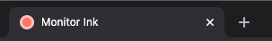

# MonitorInk

This project is currently in development.

- [ ] Future graphs
- [ ] Responsivity + dark mode
- [ ] Detail page missing
- [ ] Every refresh (10secs) it scrolls back up.. why?

---

- [ ] Use appwrite database refactor when released
- [ ] Use Appwrite realtime when released
- [ ] PROBABLY Use custom IDs when released
- [ ] MAYBE Use Appwrite deploy CLI 2.0 when released

### Screenshots




## Installation

First of all, you will need an Appwrite instance and project setup because this is just a frontend, and Appwrite will serve as a backend-as-a-service.

To install Appwrite, follow instructions [in their docs](https://appwrite.io/docs/installation). Once you have appwrite up and running, you will need to:

1. Create appwrite project

Visit your appwrite console in the browser and sign in/sign up.


After logging in, you will see a homepage with no projects, simply make one and name it whatever you want.


2. Add a platform to the project

We don't want any website to use our backend, right? That is insecure! Let's tell Appwrite what are our platforms so it can securely allow traffic in. After creating the project, you were redirected to the main project page, where you should be able to add a new platform.


We will create a `New Web App` with hostname `localhost`, and you can give it any name you want. When you deploy your project to production, don't forget to add it as a platform. The platform hostname should not include protocol or port number.

3. Generate an API key

For migration purposes, we will need an API key that gives us full access to the project. To generate that, visit the `API Keys` page and generate one.


You can name it whatever you want but make sure to select all scopes. After creating a key, click `Show Secrets` and mark down the secret. You will need that later.

4. Get project information

We will need some basic information about your server and project so everything can connect together. Visit the settings page and markdown `Project ID` and `API Endpoint`.


5. Run the initial setup/migration

Our Appwrite project is currently empty and includes no data or structure. Instead of manually defining it, we will use a programmatic setup to initialize and update the appwrite project easily. To do that, we first enter the `appwrite_setup` folder.

```
$ cd appwrite_setup
```

Before running the script, we need to tell it where to find our Appwrite. Copy the `.env.example` to `.env` and fill in the information from steps 3 and 4.

```
$ cp .env.example .env
$ nano .env
```

We also need to configure our pages so it knows what websites to ping. To do that, simply edit the `settings.json` file with your groups and projects. In this step, you can also add your branding.

```
$ nano config.json
```

This is a Node.JS project with a `migrate.js` script. We now need to install dependencies:

```
$ npm install
```

Let's run the migration! Simply run the `migrate.js`, and everything should be done within few seconds:

```
$ node migrate.js
```

If you want to update the `config.json`, you can do so, but make sure to always re-run `node migrate.js` each time you edit this file.

6. Connect Monitor Ink to Appwrite

Finally, we need to tell our frontend application (Angular) public information about our Appwrite project. We visit `src/environments/environment.ts` and update `appwriteEndpoint` and `appwriteProjectId` with information from step 4. For your production server, update the `src/environments/environment.prod.ts`. Feel free to use the same Appwrite instance for both development and testing, but I recommend you to create two separate projects, so you don't accidentally delete your production data.

7. Run the frontend

The setup is finished, and we can start the Angular project with `ng serve`. Don't forget to run `npm install` if you haven't yet.

## Development server

Run `ng serve` for a dev server. Navigate to `http://localhost:4200/`. The app will automatically reload if you change any of the source files.

## Code scaffolding

Run `ng generate component component-name` to generate a new component. You can also use `ng generate directive|pipe|service|class|guard|interface|enum|module`.

## Build

Run `ng build` to build the project. The build artifacts will be stored in the `dist/` directory.

## Running unit tests

Run `ng test` to execute the unit tests via [Karma](https://karma-runner.github.io).

## Running end-to-end tests

Run `ng e2e` to execute the end-to-end tests via a platform of your choice. To use this command, you need to first add a package that implements end-to-end testing capabilities.

## Further help

To get more help on the Angular CLI use `ng help` or go check out the [Angular CLI Overview and Command Reference](https://angular.io/cli) page.
